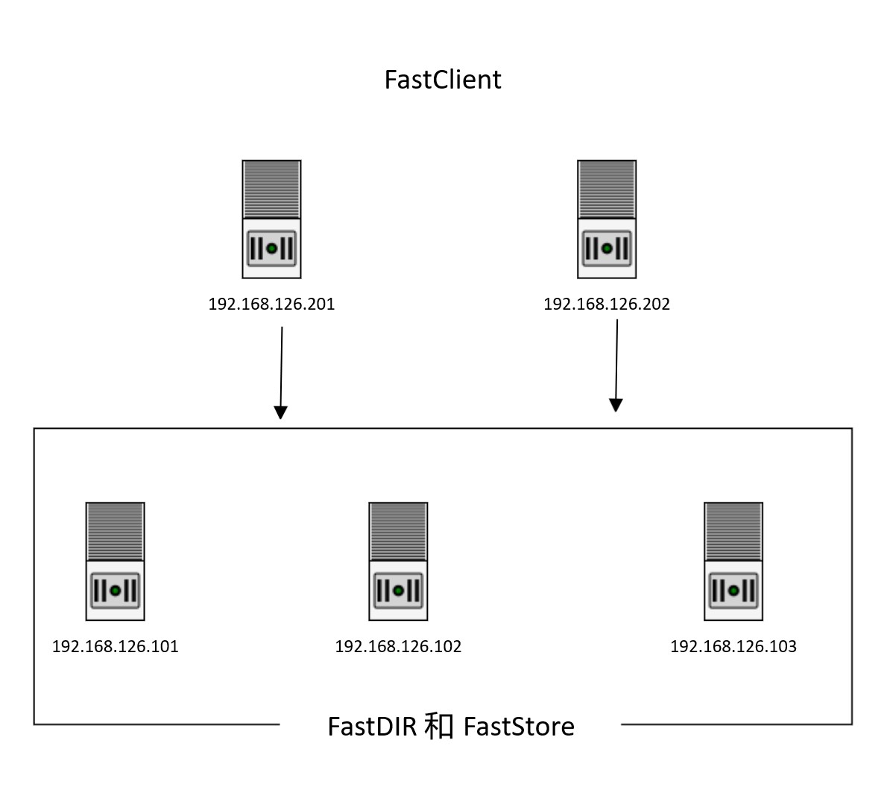

### 安装的集群架构
FastCFS支持大规模的集群，下面以最为典型的最小化集群的部署方式，说明下自定义安装的过程。更大规模的安装方式可参照此过程扩展安装。
1. 节点类型和数量：共计5个节点，3个服务端节点（3副本策略），2客户端节点
2. 服务端集群：FastStore和FastDir公用，也可以分开独立部署，生产环境建议分开。本说明为了降低节点数量，采用了公用部署的方式。
3. 客户端：为了说明支持多客户端，使用了2个客户端节点。生产环境中如果只需要1个客户端，也是没问题的。

### 前置依赖
先安装FastOS.repo yum源，FastCFS所需要的pkg都在此源中，安装成功后就可以安装FastCFS相关软件包了。

- CentOS 7
```
rpm -ivh http://www.fastken.com/yumrepo/el7/x86_64/FastOSrepo-1.0.0-1.el7.centos.x86_64.rpm
```

- CentOS 8
```
rpm -ivh http://www.fastken.com/yumrepo/el8/x86_64/FastOSrepo-1.0.0-1.el8.x86_64.rpm
```

### 服务端集群安装
在192.168.126.[101,102,103]上分别安装FastStore、FastDIR 两个服务. 
#### 安装FastDIR
```
yum install fastDIR-server
```
安装过程中会安装所依赖的包，选y就可以了. 
```
==================================================================================================================
 Package                            Architecture          Version                     Repository             Size
==================================================================================================================
Installing:
 fastDIR-server                     x86_64                2.0.1-1.el8                 FastOS                 71 k
Installing dependencies:
 FastCFS-auth-client                x86_64                2.0.1-1.el8                 FastOS                 36 k
 FastCFS-auth-config                x86_64                2.0.1-1.el8                 FastOS                 10 k
 fastDIR-config                     x86_64                2.0.1-1.el8                 FastOS                9.5 k
 libfastcommon                      x86_64                1.0.50-1.el8                FastOS                140 k
 libserverframe                     x86_64                1.1.7-1.el8                 FastOS                 47 k

Transaction Summary
==================================================================================================================
Install  6 Packages

Total download size: 313 k
Installed size: 711 k
Is this ok [y/N]: y   // 安装过程中会安装所依赖的包，选y就可以了. 

```
安装完毕后，在/etc/fastcfs 下可看到fdir的目录，存储的是FastDIR的配置文件.  配置项的内容，后续会说明。
```
$ ll /etc/fastcfs/fdir/
total 16
-rw-r--r--. 1 root root 1565 May  9 13:49 client.conf
-rw-r--r--. 1 root root  753 May  9 13:49 cluster.conf
-rw-r--r--. 1 root root 5242 May  9 13:49 server.conf
```
#### 安装FastStore

```
yum install faststore-server
```
再说明下：实际生产环境部署中，FastDIR是和FastStore两个服务可以分开部署的，不需要再同一台服务器上。
```
==================================================================================================================
 Package                          Architecture           Version                     Repository              Size
==================================================================================================================
Installing:
 faststore-server                 x86_64                 2.0.1-1.el8                 FastOS                 134 k
Installing dependencies:
 faststore-config                 x86_64                 2.0.1-1.el8                 FastOS                  11 k

Transaction Summary
==================================================================================================================
Install  2 Packages

Total download size: 145 k
Installed size: 422 k
Is this ok [y/N]: y  // 安装过程中会安装所依赖的包，选y就可以了. 
```
安装完毕后，在/etc/fastcfs 下可看到fstore目录，存储的是FastStore的配置文件。配置项的内容，后续会说明。
```
$ ll /etc/fastcfs/fstore/
total 20
-rw-r--r--. 1 root root 1577 May  9 13:52 client.conf
-rw-r--r--. 1 root root 3256 May  9 13:52 cluster.conf
-rw-r--r--. 1 root root 4965 May  9 13:52 server.conf
-rw-r--r--. 1 root root 2609 May  9 13:52 storage.conf
```

### 安装客户端
在192.168.126.[201,202]上安装Client包, 包名为FastCFS-fused. 
```
yum remove fuse -y // 仅第一次安装时执行
yum install FastCFS-fused -y 
```
原CentOS中fuse为老版本的包（fuse2.x），需要卸载才可以成功安装FastCFS-fused依赖的fuse3。第一次安装才需要卸载fuse包，以后就不用执行了。

安装完毕后，在/etc/fastcfs 下可看到以下目录，存储是对应服务的配置文件.  
```
$ ll /etc/fastcfs/
drwxr-xr-x. 3 root root 113 May 14 15:20 auth
drwxr-xr-x. 2 root root  23 May 14 15:20 fcfs
drwxr-xr-x. 2 root root  64 May 14 15:20 fdir
drwxr-xr-x. 2 root root  84 May 14 15:20 fstore
```
**为什么在Client的节点上，需要有fdir和fstore的目录呢？因为FastCFS是无中心配置的，Client需要知道fdir和fstore的集群情况，所以就需要fdir和fstore的配置文件。**

### 自定义安装配置
#### 说明
FastCFS并没有统一的配置中心，需要在各个节点上单独部署配置文件。配置文件分为两大类：集群配置文件和服务配置文件。

1. **集群配置文件：** 指的是描述 FastDir 和 FastStore 的配置文件，入口文件名称为cluster.conf . 该配置文件中设定是集群的参数，如服务节点的IP和端口号，服务节点的数量等。 cluster.conf 文件全局统一，各个节点上的内容是相同的, FastDir 和 FastStore 有各自的cluster.conf文件。

2. **服务配置文件：** 指的是服务本身的配置文件，入口文件名称server.conf 如线程数量、链接数量、缓冲区大小、日志配置等。 服务配置文件的内容，可以全局不统一。不过从集群的角度考虑，如果各服务器配置相同，最好是统一的。 

#### FastDIR 配置

1. **配置文件说明** 
```
$ ll /etc/fastcfs/fdir/ 
-rw-r--r--. 1 root root 1565 May  9 13:49 client.conf // 暂时不使用，不用关注
-rw-r--r--. 1 root root  753 May  9 13:49 cluster.conf // 集群配置文件
-rw-r--r--. 1 root root 5242 May  9 13:49 server.conf // 服务配置文件 
```

2. **集群配置文件** ：在101节点上，修改/etc/fastcfs/fdir/cluster.conf 文件，修改为正确的IP地址，修改后的内容如下
```
  1 # config the auth config filename
  2 auth_config_filename = /etc/fastcfs/auth/auth.conf
  3
  4
  5 [group-cluster]
  6 # the default cluster port
  7 port = 11011  // 集群之间的通信使用的默认端口号，不用修改
  8
  9 [group-service]
 10 # the default service port
 11 port = 11012  // 对client提供服务，使用的默认端口号，不用修改
 12
 13 # config a server instance
 14 # section format: [server-$id]
 15 # server id is a 32 bits natural number (1, 2, 3 etc.),
 16 [server-1]
 17
 18 # format: host[:port]
 19 # host can be an IP address or a hostname
 20 # IP address is recommended
 21 # can occur more than once
 22 host = 192.168.126.101  // 节点101的地址，使用默认的端口号
 23
 24 [server-2]
 25 # cluster-port = 11013
 26 # service-port = 11014
 27 host = 192.168.126.102 // 节点102的地址，使用默认的端口号
 28
 29 [server-3]
 30 # cluster-port = 11015
 31 # service-port = 11016
 32 host = 192.168.126.103  // 节点103的地址，使用默认的端口号

```
3. **服务配置文件** ： 在101节点上，/etc/fastcfs/fdir/server.conf, 该文件配置项较多，但默认不用任何调整，确认文件底部的[service]区内容就好.
```
180 [cluster]
181 # bind an address of this host
182 # empty for bind all addresses of this host
183 bind_addr =
184
185 # the listen port
186 port = 11011
187
188 # the accept thread count
189 # default value is 1 which is recommended
190 accept_threads = 1
191
192 # the network thread count
193 # these threads deal network io
194 # dispatched by the incoming socket fd
195 # default value is 4
196 work_threads = 2
197
198 [service]
199 bind_addr =  // 保持为空，FastDIR 会自动使用本机的IP地址
200 port = 11012  // 确保与cluster.conf 中 group-service 的设定值相同
201 accept_threads = 1
202 work_threads = 4
```
4. 把cluster.conf文件复制到102-103,201-202 这5台服务器上,保证所有节点都能知道集群配置
```
scp /etc/fastcfs/fdir/cluster.conf 192.168.126.102:/etc/fastcfs/fdir/
scp /etc/fastcfs/fdir/cluster.conf 192.168.126.103:/etc/fastcfs/fdir/
scp /etc/fastcfs/fdir/cluster.conf 192.168.126.201:/etc/fastcfs/fdir/
scp /etc/fastcfs/fdir/cluster.conf 192.168.126.202:/etc/fastcfs/fdir/
```

#### FastStore 配置

1. **配置文件说明** 
```
$ ll /etc/fastcfs/fstore
-rw-r--r--. 1 root root 1577 May  9 13:52 client.conf // 暂时不使用，不用关注
-rw-r--r--. 1 root root 3253 May 14 13:08 cluster.conf // 集群配置文件
-rw-r--r--. 1 root root 4965 May  9 13:52 server.conf // 服务配置文件
-rw-r--r--. 1 root root 2609 May  9 13:52 storage.conf // 服务配置文件
```

2. **集群配置文件** ：在101节点上，修改/etc/fastcfs/fstore/cluster.conf 文件，仅需要修改server_ids的值和[group-cluster]部分，其它参数不需要调整。修改后的内容如下. 
```
 57 [server-group-1]
 58
 59 # config one or more server id(s) from servers.conf
 60 ## multiple server ids separated by comma(s).
 61 ## [start, end] for range, including start and end.
 62 # this parameter can occurs more than once.
 63 # server_ids = [1, 3]
 64 server_ids = [1,3]  //  使用了3副本的策略，有3个服务节点101/102/103，所以设定为[1,3]
 65
 66 # the data group id based 1. the formats as:
 67 ##  * multiple data group ids separated by comma(s).
 68 ##  * [start, end] for range, including start and end.
 69 # this parameter can occurs more than once.
 70 data_group_ids = [1, 32]
 71 data_group_ids = [33, 64]
 72
 73
 74 [group-cluster]
 75 # the default cluster port
 76 port = 21014  // 集群之间的通信使用的默认端口号，不用修改
 77
 78 [group-replica]
 79 # the default replica port
 80 port = 21015 // Master-Slave 之间同步数据使用的默认端口号，不用修改
 81
 82 [group-service]
 83 # the default service port
 84 port = 21016  // 对Client提供服务，使用的默认端口号，不用修改
 85
 86 # config a server
 87 # section format: [server-$id]
 88 # server id is a 32 bits natural number (1, 2, 3 etc.),
 89 [server-1]
 90
 91 # format: host[:port]
 92 # host can be an IP address or a hostname
 93 # IP address is recommended
 94 # can occur more than once
 95 host = 192.168.126.101  // 节点101的地址，使用默认的端口号 
 96 
 97 [server-2]
 99 host = 192.168.126.102 // 节点102的地址，使用默认的端口号
100
101 [server-3]
103 host = 192.168.126.103  // 节点103的地址，使用默认的端口号
```
3. **服务配置文件** 在101节点上，/etc/fastcfs/fstore/server.conf 和  /etc/fastcfs/fstore/storage.conf. 默认均需要修改，只需确认下server.conf的配置是否正确
```
190 [replica]
191 bind_addr =
192 port = 21015  // 保持与fstore/server.conf 中 [group-replica]设定的port值相同
193 accept_threads = 1
194 work_threads = 4
195
196 [service]
197 bind_addr =
198 port = 21016  // 保持与fstore/server.conf 中 [group-service]设定的port值相同
199 accept_threads = 1
200 work_threads = 4
```
4. 把cluster.conf文件复制到102-103,201-202 这5台服务器上，保证所有节点都能知道集群配置
```
scp /etc/fastcfs/fstore/cluster.conf 192.168.126.102:/etc/fastcfs/fstore/
scp /etc/fastcfs/fstore/cluster.conf 192.168.126.103:/etc/fastcfs/fstore/
scp /etc/fastcfs/fstore/cluster.conf 192.168.126.201:/etc/fastcfs/fstore/
scp /etc/fastcfs/fstore/cluster.conf 192.168.126.202:/etc/fastcfs/fstore/
```

#### FastClient 配置
1. Client 需要知道FastDIR和FastStore的集群配置数据，在上述scp过程中，已经分别scp到了对应的目录下，不需要修改.
2. Client 自身的配置文件为 /etc/fastcfs/fcfs/fuse.conf 属于服务配置文件，也不需要修改. 
 
### 启动服务

安装并配置完成后，可以启动服务并验证.

1. **关闭防火墙：** CentOS 8 默认情况下开启防火墙，会导致各节点之间无法访问，可暂关闭防火墙。
```
sudo systemctl stop firewalld.service
```
2. **启动FastDir：***  在101/102/103 三个节点上，执行下列命令启动. 注意必须是3个节点都启动。
```
sudo systemctl restart fastdir
```
或者
```
sudo /usr/bin/fdir_serverd /etc/fastcfs/fdir/server.conf restart
```
查看日志，确认启动成功.
```
$ tail /opt/fastcfs/fdir/logs/fdir_serverd.log

[2021-05-14 15:39:36] ERROR - file: connection_pool.c, line: 140, connect to server 192.168.126.102:11011 fail, errno: 113, error info: No route to host
[2021-05-14 15:39:36] ERROR - file: connection_pool.c, line: 140, connect to server 192.168.126.103:11011 fail, errno: 113, error info: No route to host
[2021-05-14 15:39:36] INFO - file: cluster_relationship.c, line: 668, round 19th select master, alive server count: 1 < server count: 3, the candidate server status: 0 (INIT) does not match the selection rule. you must start ALL servers in the first time, or remove the deprecated server(s) from the config file. try again after 32 seconds.
[2021-05-14 15:40:01] INFO - file: cluster_relationship.c, line: 474, the master server id: 3, ip 192.168.126.103:11011
```
日志中有error提示，是因为防火墙导致的3个节点无法互相通信产生的，关闭防火墙后FastDIR会自动进行尝试链接。从最后一行INFO日志可看到，服务已经启动成功了，并且选择了103节点作为Master. 

3. **启动FastStore:** 与FastDir的启动方式类似，在101/102/103 三个节点上，执行下列命令启动. 注意必须是3个节点都启动。
```
sudo systemctl restart faststore
```
或者
```
sudo /usr/bin/fs_serverd /etc/fastcfs/fstore/server.conf restart
```
查看日志，确认启动成功.
```
[2021-05-14 16:06:08.326966] INFO - file: replication/replication_processor.c, line: 419, connect to replication peer id: 3, 192.168.126.103:21015 successfully
[2021-05-14 16:06:08.344415] INFO - file: replication/replication_processor.c, line: 419, connect to replication peer id: 3, 192.168.126.103:21015 successfully
[2021-05-14 16:06:08.368437] INFO - file: replica_handler.c, line: 598, replication peer id: 1, 192.168.126.101:21014 join in
[2021-05-14 16:06:09.942673] INFO - file: replica_handler.c, line: 598, replication peer id: 1, 192.168.126.101:21014 join in
[2021-05-14 16:06:10.374344] INFO - file: recovery/binlog_fetch.c, line: 589, data group id: 1, wait replica channel of master id 1 ready success, waiting count: 2
[2021-05-14 16:06:10.415848] INFO - file: recovery/binlog_fetch.c, line: 589, data group id: 6, wait replica channel of master id 1 ready success, waiting count: 2
```
看到以上类似的日志，即是启动成功了。 

4. **启动FastClient：** 在201、202 节点上启动Client.
```
sudo systemctl restart fastcfs
```
或者
```
sudo  /usr/bin/fcfs_fused /etc/fastcfs/fcfs/fuse.conf restart
```
查看日志，确认启动成功
```
$ tail /opt/fastcfs/fcfs/logs/fcfs_fused.log 
[2021-05-14 16:14:15] INFO - file: sf_nio.c, line: 205, connect to server 192.168.126.101:11012 successfully
[2021-05-14 16:14:15] INFO - file: sf_nio.c, line: 205, connect to server 192.168.126.103:11012 successfully
[2021-05-14 16:14:15] INFO - file: sf_connection_manager.c, line: 827, [FastDIR] connection manager thread start
[2021-05-14 16:14:15] INFO - file: sf_connection_manager.c, line: 827, [FastStore] connection manager thread start
[2021-05-14 16:14:55] INFO - file: sf_nio.c, line: 205, connect to server 192.168.126.101:21016 successfully
```
查看文件目录是否成功挂载
```
$ df -h
Filesystem           Size  Used Avail Use% Mounted on
devtmpfs             189M     0  189M   0% /dev
tmpfs                219M     0  219M   0% /dev/shm
tmpfs                219M  6.6M  212M   4% /run
tmpfs                219M     0  219M   0% /sys/fs/cgroup
/dev/mapper/cs-root   47G  4.9G   43G  11% /
/dev/sda1           1014M  242M  773M  24% /boot
tmpfs                 44M  4.0K   44M   1% /run/user/1000
/dev/fuse             38G     0   38G   0% /opt/fastcfs/fuse  // 这是即是FastCFS挂载的根目录
```
5. 验证 ：在201节点上创建文件
```
[first@192.168.126.201 /opt/fastcfs/fuse]
$ mkdir -p abc/123
[first@192.168.126.201 /opt/fastcfs/fuse]
$ touch abc/123/demo.txt
[first@192.168.126.201 /opt/fastcfs/fuse]
$ vim abc/123/demo.txt
[first@192.168.126.201 /opt/fastcfs/fuse]
$ ll abc/123
total 1
-rw-rw-r--+ 1 first first 13 May 14 16:22 demo.txt  
```
在202节点上查看该文件，可见文件已经创建成功了
```
[first@192.168.126.202 /opt/fastcfs/fuse]
$ tail abc/123/demo.txt
hello world
[first@192.168.126.202 /opt/fastcfs/fuse]
```

### 服务监控
1. 查看FastDir集群状态
```
$ fdir_cluster_stat
server_id: 1, host: 192.168.126.101:11012, status: 23 (ACTIVE), is_master: 0
server_id: 2, host: 192.168.126.102:11012, status: 23 (ACTIVE), is_master: 0
server_id: 3, host: 192.168.126.103:11012, status: 23 (ACTIVE), is_master: 1

server count: 3
```
2. 查看单个FastDir节点状态
```
[first@192.168.126.201 /etc/fastcfs/fcfs]
$ fdir_service_stat 192.168.126.101:11012
        server_id: 1
        status: 23 (ACTIVE)
        is_master: false
        connection : {current: 4, max: 4}
        binlog : {current_version: 24}
        dentry : {current_inode_sn: 1000009, ns_count: 1, dir_count: 3, file_count: 1}
```
3. 查看FastStore集群状态
```
$ fs_cluster_stat | more

data_group_id: 1
        server_id: 1, host: 192.168.126.101:21016, status: 5 (ACTIVE), is_preseted: 1, is_master: 1, data_version: 0
        server_id: 2, host: 192.168.126.102:21016, status: 5 (ACTIVE), is_preseted: 0, is_master: 0, data_version: 0
        server_id: 3, host: 192.168.126.103:21016, status: 5 (ACTIVE), is_preseted: 0, is_master: 0, data_version: 0

data_group_id: 2
        server_id: 1, host: 192.168.126.101:21016, status: 5 (ACTIVE), is_preseted: 0, is_master: 0, data_version: 0
        server_id: 2, host: 192.168.126.102:21016, status: 5 (ACTIVE), is_preseted: 1, is_master: 1, data_version: 0
.....................
```
4. 查看磁盘使用情况
```
df -h 
```
